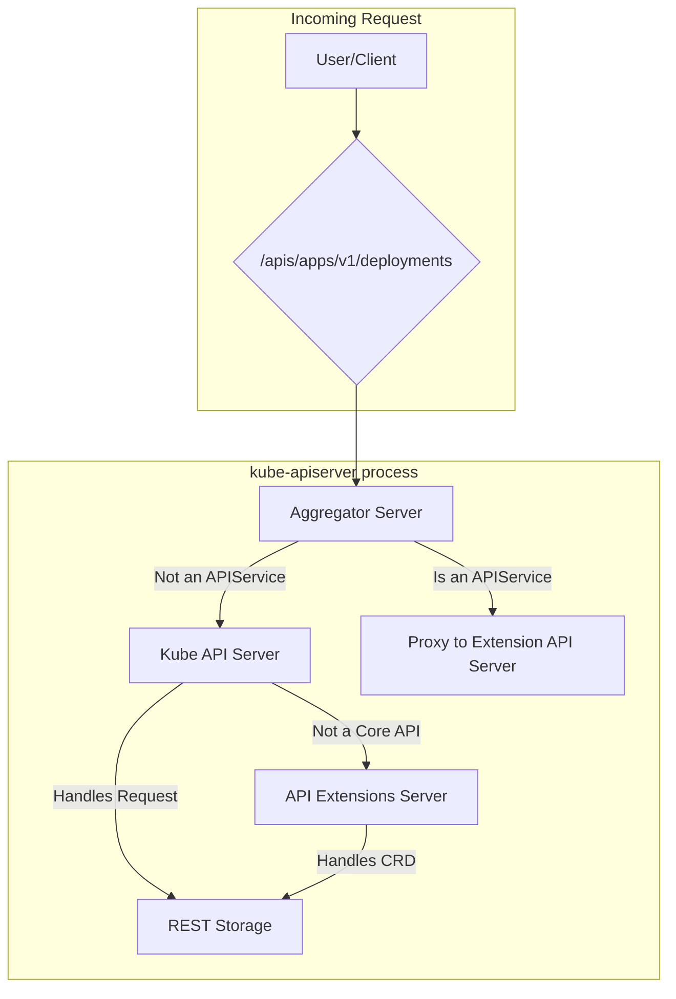
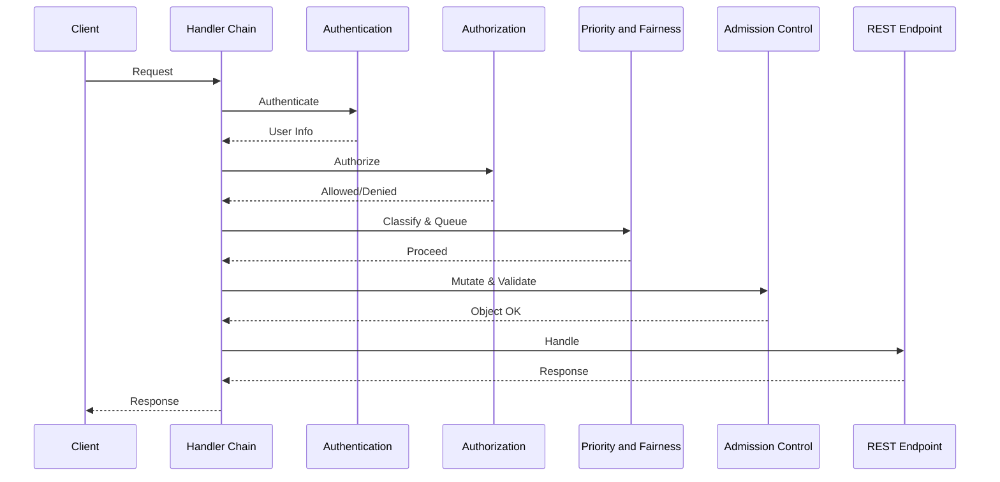
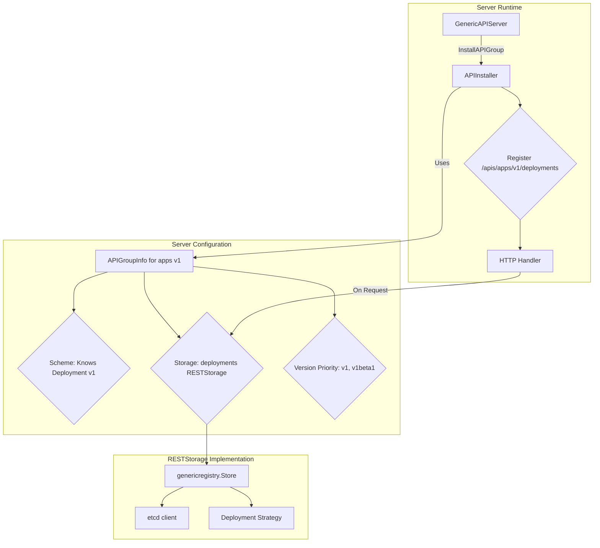

# apiserver Architecture

## 1. Server Composition

The `kube-apiserver` binary is not one server, but a **server chain** of three distinct
`GenericAPIServer` instances: the core Kubernetes API, API extensions (CRDs), and the aggregation
layer.

This composition is managed by a layered configuration system, starting with command-line
flags parsed by `options` structs (e.g., `RecommendedOptions` in `pkg/server/options`), which
populate a `Config` object that is then used to instantiate the `GenericAPIServer`
instances. The construction of this delegation chain can be found in the `CreateServerChain`
function in `cmd/kube-apiserver/app/server.go`.



1.  **Aggregator Server (`kube-aggregator`):**
    *   **Purpose:** Handles the `apiregistration.k8s.io` API and acts as a reverse proxy for
        extension API servers. This functionality was designed to allow third-party APIs to be
        "aggregated" into the main Kubernetes API server seamlessly.
    *   **Mechanism:** It watches `APIService` objects. When a request arrives (e.g., for
        `/apis/mycompany.com/v1/myresources`), it checks if an `APIService` has "claimed"
        that path. If so, it uses a `ServiceResolver` to find the IP of the backing
        `Service` and proxies the request.
    *   **Use Case:** This pattern is for programmatic, high-control extensions that require
        custom business logic (e.g., non-CRUD subresources like `/logs`) or alternative
        storage backends.
    *   **Delegation:** If no `APIService` matches, it delegates the request to the next
        server in the chain.

2.  **Kube API Server (Core):**
    *   **Purpose:** Serves all the built-in Kubernetes APIs (`core/v1`, `apps/v1`, etc.).
    *   **Mechanism:** This is the main server, configured with all the core REST storage
        strategies.
    *   **Delegation:** If a request is for a path that is not a core API (e.g., for a CRD),
        it delegates the request to the next server in the chain.

3.  **API Extensions Server (`apiextensions-apiserver`):**
    *   **Purpose:** Handles the `apiextensions.k8s.io` API, which manages
        `CustomResourceDefinition` objects (CRDs). The evolution of CRDs from a simple extension
        mechanism to a feature-rich system with validation, versioning, and defaulting is
        documented in a series of KEPs, starting with the graduation to GA in Kubernetes v1.16.
    *   **Mechanism:** When a CRD is created, this server dynamically creates and installs a
        new REST storage handler for the new resource, making it immediately available.
    *   **Use Case:** CRDs are the most common extension pattern, offering a declarative,
        schema-based way to define new resource types that are stored in etcd and require no
        custom API server code.
    *   **Delegation:** It is the end of the chain. If it cannot handle a request, a `404 Not
        Found` is returned.

## 2. Handler Chain

Every request flows through a standard chain of HTTP handlers (filters). The request body
is not deserialized until it has passed authentication and authorization. The default handler
chain is constructed by the `DefaultBuildHandlerChain` function in
`staging/src/k8s.io/apiserver/pkg/server/config.go`.



The handler chain consists of the following stages:

1.  **Authentication (`pkg/authentication`):** This filter identifies the user. The system is
    pluggable and composed of multiple authenticators (e.g., client certs, bearer tokens, OIDC).
    The identity of the user is determined by the first authenticator in the chain that successfully
    identifies the user.
2.  **Authorization (`pkg/authorization`):** This filter checks if the user is permitted to
    perform the action. This system is also pluggable and composed of multiple authorizers
    (e.g., RBAC, Node, Webhook). Each authorizer may respond with either allow, deny, or no opinion.
    If the response is no opinion, the request is passed to the next authorizer in the chain.
3.  **Priority and Fairness (`pkg/util/flowcontrol`):** This subsystem manages request
    concurrency, classifying requests into `FlowSchema`s and `PriorityLevel`s to prevent
    overload. This feature was introduced to prevent high traffic from overwhelming the API
    server and to ensure that critical cluster operations are not starved.
4.  **Admission Control (`pkg/admission`):** This is the primary mechanism for policy
    enforcement. It is only at this stage that the request body is deserialized into an
    object. It is a chain of plugins that can mutate or validate an object. The built-in Pod
    Security admission controller is a key example of this, enforcing Pod Security Standards
    at the namespace level.
5.  **REST Endpoint Handling (`pkg/endpoints`):** The request is finally dispatched to the
    appropriate REST handler, which is installed by the `APIInstaller`.

## 3. API Group Registration

The high-level steps for introducing an API are:

1.  **Define Types:** Create or modify the Go structs in the `types.go` file for the API group.
2.  **Generate Code:** Use the code generators provided by the Kubernetes project to create the required
    boilerplate methods for deep-copy, conversion, and defaulting.
3.  **Implement the `Strategy`:** Write the custom business logic and validation for the
    resource in its `Strategy` object.
4.  **Register and Install:** Create the `APIGroupInfo` struct, bundling the `Scheme` and the
    `Strategy`-configured storage, and pass it to the `GenericAPIServer`'s `InstallAPIGroup`
    method.

### The API Group Registry

The `runtime.Scheme` acts as a central registry for an API group's type information. A single
`Scheme` object is created for each API group and is responsible for the following key
capabilities:

*   **Type Registration and Mapping:** The `Scheme`'s primary role is to map a GroupVersionKind
    (GVK) to its corresponding Go type and back. This process also relies on the `deepcopy-gen`
    tool to create `DeepCopy()` methods for each type, which is critical for ensuring that
    objects returned from caches are never modified directly.

*   **API Conversion:** The `Scheme` stores the conversion functions that translate objects
    between different API versions. These functions are typically generated by the
    `conversion-gen` tool and enable the **hub-and-spoke** model.

*   **Defaulting:** The `Scheme` registers defaulting functions that populate optional fields in
    an object. These are usually generated by the `defaulter-gen` tool.

*   **Declarative Validation:** The `Scheme` can store and execute code-generated validation
    functions, providing a baseline level of validation. This is distinct from the primary,
    handwritten business logic validation, which is handled by the `Strategy` object.

### The `APIGroupInfo` Struct and `Strategy` Object

With a populated `Scheme`, the API group is registered with the `GenericAPIServer` by bundling
the `Scheme` with the storage backend and versioning information into an `APIGroupInfo` struct.



The registration process follows these steps:

1.  **`APIGroupInfo` Construction:** For each API group, an `APIGroupInfo` struct is created,
    which contains the populated `Scheme`, a map of resources to their storage
    implementations, and an ordered list of **Version Priority**.

2.  **REST Storage Instantiation:** For each resource, a `genericregistry.Store` is created. It
    is configured with a resource-specific `Strategy` object that contains the core business
    logic (e.g., handwritten validation).

3.  **API Group Installation:** The `GenericAPIServer`'s `InstallAPIGroup` method takes the
    `APIGroupInfo` and uses an `APIInstaller` to expose the resources as HTTP endpoints.

## 4. Watch Cache

To handle the high volume of watch requests from controllers without overwhelming etcd, the
apiserver uses a **watch cache**. The implementation can be found in
`staging/src/k8s.io/apiserver/pkg/storage/cacher/`.

*   **Initialization:** The cacher first performs a `LIST` to get the current state of all
    objects and a `ResourceVersion` for that point-in-time. It then starts a `WATCH` from
    that version to ensure a consistent stream of events.
*   **Serving from Cache:** Most list and watch requests are served from this in-memory cache, which
    dramatically reduces the load on etcd. Consistent reads are also served from the
    cache. This is achieved by first fetching the revision number of the latest write from
    etcd. The server then ensures the cache is at least that recent—waiting for it to
    refresh if necessary—before serving the request.
*   **Fallback to Storage:** If a client request cannot be served from the
    cache's buffer, the request "falls through" to the underlying etcd storage.
*   **Bookmarks:** The cacher uses bookmark events to track the latest `ResourceVersion` for
    unchanged objects. This prevents the cache's `ResourceVersion` from becoming too old,
    which avoids the need for expensive relist operations from etcd when the objects have
    not been modified.

## 5. Conflict Resolution

*   **Optimistic Concurrency via `resourceVersion`:** Clients are expected to perform updates using a
    read-modify-write workflow. The apiserver uses the `resourceVersion` field of every
    object to enforce optimistic concurrency. This `resourceVersion` is not an arbitrary number;
    it maps directly to etcd's globally consistent `mod_revision`. When a client submits an
    update (`PUT` or `PATCH`), it must provide the `resourceVersion` of the object it based its
    modifications on. If the `resourceVersion` on the server does not match the current
    `mod_revision` in etcd, the server rejects the request with a `409 Conflict` error. This
    forces the client to re-read the object, resolve the conflict, and resubmit with the new
    `resourceVersion`.
*   **Server-Side Apply:** A declarative, "intent-based" patch. The server maintains a
    `managedFields` section in the object's metadata to track which "manager" (e.g., a
    controller) owns each field. This allows multiple actors to manage different parts of the
    same object without overwriting each other's changes.

## 6. Discovery and OpenAPI

Apiservers serve the `/apis` discovery endpoints and the `/openapi/v2` and `/openapi/v3`
specifications. The generation of the OpenAPI specification is a multi-stage process.

*   **`openapi-gen`**: This tool reflects on Go structs, reads godoc comments, and looks at
    validation struct tags to generate a map of all API definitions.
*   **`zz_generated.openapi.go`**: The output is a large Go file containing a
    `GetOpenAPIDefinitions` function.
*   **Runtime**: The `GenericAPIServer` calls this generated function to build the final OpenAPI
    JSON spec that it serves to clients.

## 7. Security & Observability

*   **Audit (`pkg/audit`):** The apiserver has a policy-driven event logging pipeline. The audit
    policy controls what is logged and at which stage of a request.
*   **Security:**
    *   **mTLS:** The primary authentication mechanism for system components.
    *   **Service Account Token Issuance:** The `kube-apiserver` acts as an OIDC provider,
        issuing and validating JWTs for `ServiceAccount`s.

## 8. Streaming Protocols

*   **Websockets:** The apiserver uses websockets to upgrade HTTP
    connections for interactive, streaming protocols like `exec`, `attach`, and
    `port-forward`. The `UpgradeAwareProxyHandler` manages this process.

## 9. SQLite and MySQL storage migration

The SQL adapters use versioned `storage_meta`, `storage_objects`,
`storage_history`, and `storage_policy` tables. Public factory keys are relative:
`Prefix=/registry` and resource `/pods` persist `/registry/pods/ns/name`.
Transformers authenticate the complete persisted key. The policy singleton stores
history retention in nanoseconds; migration establishes the default 75 seconds.
An existing incompatible policy is rejected, never silently replaced.

Normal startup only inspects the source catalog and schema readiness. It refuses
legacy SQLite `keyval` or MySQL JSON tables without an explicit completed offline
migration. It never automatically migrates or discards source tables. An empty
new database takes the normal initialization path without scanning object data.

### Offline migration and configuration

Stop **all** old and new writers, including background jobs, and verify a backup
before migration. The caller must enforce this operational exclusion; the library
does not fence an old binary. Use `sqlstorage.MigrateLegacy(ctx, db, dialect,
mappings)` with an explicit source table, complete resource prefix, namespace
scope, target `runtime.Codec`, and target `value.Transformer` for every mapping.
The caller owns and closes the SQL pool. Use bounded native driver I/O deadlines.
Do not migrate into an existing live target, even if it is currently empty.

SQLite OLD format is `keyval(key TEXT, revision interger, obj TEXT,
PRIMARY KEY(key))`; the historical `interger` spelling is intentional. MySQL OLD
format has per-resource tables with `id`, nullable `name` and `namespace`,
`revision`, and `obj JSON`, unique on `(name, namespace)`. These formats were
verified at `6814c6b5ce24ed8d296c379e2ce069d591b377a6`. No historical ORM is used.
SQLite may map multiple disjoint full prefixes in `keyval`; every row must match
one mapping. MySQL requires one mapping per JSON table. Mixed groups or kinds,
missing/overlapping mappings, duplicate target identities, NULL namespaces,
empty namespaces for scoped objects, corrupt objects, and lossy codec conversions
are rejected. Cluster-scoped objects require an explicitly unscoped mapping and
an empty (non-NULL) SQL namespace. Resolve ambiguous source data under the old
system and take a new backup; the migration tool does not guess a group or repair
source rows. Only obsolete resourceVersion and selfLink are normalized; full keys,
UIDs, and all other semantic content are verified.

Build the internal runner with the pinned Go toolchain. The **supported CLI is
`run.sh`**, which maps the runner's structured result to exit status 0 or 1. The
internal Go runner always returns normally after cleanup and cannot itself
supply a failure process status. Never automate using that internal runner alone.
The wrapper creates no temporary files and sends no DSNs through arguments.

```sh
GOTOOLCHAIN=go1.27.2 go build -o /tmp/sql-storage-migrate-runner ./cmd/sql-storage-migrate
chmod 600 /secure/sql-migration.json
sh cmd/sql-storage-migrate/run.sh /tmp/sql-storage-migrate-runner /secure/sql-migration.json
```

Create the configuration privately; the DSN belongs only in this owner-readable
regular file, never in command arguments or logs. The JSON example uses a local
SQLite file. For MySQL choose `backend: mysql`, a native driver DSN selecting an
existing database, and the actual source table name instead of `keyval`.

```json
{
  "backend": "sqlite",
  "dsn": "/var/lib/service/storage.db",
  "writersStopped": true,
  "backupVerified": true,
  "mappings": [
    {
      "sourceTable": "keyval",
      "resourcePrefix": "/registry/pods",
      "namespaceScoped": true,
      "transformation": { "mode": "identity" }
    }
  ]
}
```

The CLI's generic JSON codec is
`unstructured.UnstructuredJSONScheme` (a `runtime.Codec` in the pinned API).
Identity must be explicitly selected and must match the application's target
configuration. To use AES-GCM, set transformation to
`{"mode":"aesgcm","keyFile":"/secure/storage-key","keyName":"key1"}`.
The private key file contains a base64-encoded 32-byte key. The application must
use that same key and `k8s:enc:aesgcm:v1:key1:` transformer prefix. Other target
codec/encryption configurations require the library API with their actual
transformer; absence of configuration never means identity. MySQL native
connect/read/write timeouts default to 10 seconds; SQLite busy timeout defaults
to 5000 milliseconds. Credentials, object bodies, and key material are omitted
from CLI errors and reports.

### Publication, interruption and verification

Migration records `storage_migration.phase=staging` before creating target
schema, whose initial `storage_meta.schema_version` is 0. MySQL commits DDL
implicitly, so those durable staging artifacts intentionally survive failure.
The source stays unchanged. Under the global revision lock, one DML transaction
copies objects and initial history, reads them back through the actual codec and
transformer, compares semantic content and counts, installs the retention policy,
and publishes both schema version 1 and `phase=ready`. Until that commit, normal
startup refuses the target. Failure or process death rolls back copied data;
rerun the same supported command after checking the source and configuration.
Do not manually set readiness, drop source tables, or clear staging tables.

Reports contain checked/copied counts, a SHA-256 integrity digest of ordered full
keys and normalized semantic content, and the new baseline revision. Failed
copies report zero committed copies. Repeating a completed migration validates
its mapping digest, source digest, policy, current objects and history; it never
reimports. A changed source, incompatible transform, damaged target, or new
business revision is rejected. This implementation materializes the source
objects in memory and copies them in one transaction; plan memory and transaction
capacity for the dataset before using it.

The baseline exceeds all parseable old object and row revisions. The compaction
floor is advanced to that baseline; old nonzero List/Watch tokens must relist.
A fresh List returns the new baseline and a Watch from it replays later committed
writes. Revision 0 keeps its ordinary fresh-read/initial-events meaning.
`Options.Prefix=""` with the complete mapping prefix and the actual factory's
`Prefix="/registry"` plus resource `/pods` address identical objects and AAD.

### Backup restoration and downgrade boundary

Test restoration into a **fresh location/database**, verify old counts/content,
and only then redirect a stopped old service. Never restore over a running
service. Example SQLite backup and restore, with writers stopped:

```sh
umask 077
sqlite3 /var/lib/service/storage.db '.backup /secure/storage-before.db'
sqlite3 /secure/storage-before.db 'PRAGMA integrity_check;'
# The destination must not already exist and must have no associated WAL/SHM files.
cp -n /secure/storage-before.db /var/lib/service/restored-old.db
sqlite3 /var/lib/service/restored-old.db 'PRAGMA integrity_check; SELECT count(*) FROM keyval;'
```

For MySQL keep authentication/socket settings in an owner-readable defaults file;
`SOURCE_DATABASE` and `FRESH_RESTORE_DATABASE` below are database names, never
DSNs. Provision the fresh empty restore database through your normal controlled
administration process before importing.

```sh
umask 077
mysqldump --defaults-extra-file=/secure/mysql-client.cnf --single-transaction --routines --triggers SOURCE_DATABASE > /secure/storage-before.sql
mysql --defaults-extra-file=/secure/mysql-client.cnf FRESH_RESTORE_DATABASE < /secure/storage-before.sql
mysql --defaults-extra-file=/secure/mysql-client.cnf FRESH_RESTORE_DATABASE
# In the interactive session, verify each mapped source table's row count and content.
```

Both backends have tests that restore a pre-migration backup to a separate real
database and compare source integrity before re-migrating. SQLite uses a physical
`VACUUM INTO` snapshot; the MySQL test archives `SHOW CREATE TABLE` plus every
source row into a private logical backup and restores it with bound values.
Those tests do not prove an operator's backup media, external routines, or grants;
verify the deployment backup independently.

Returning to old binaries is supported only from the verified pre-migration
backup **before any new business writes**. After new writes, old retained tables
are stale: switching binaries loses accepted changes. Keep the new version or
perform a separately designed reconciliation/export and recovery procedure.
Automatic downgrade, reverse migration, source deletion, apimaster options,
HTTP/cacher/informer integration and application startup migration are outside
this migration task.
